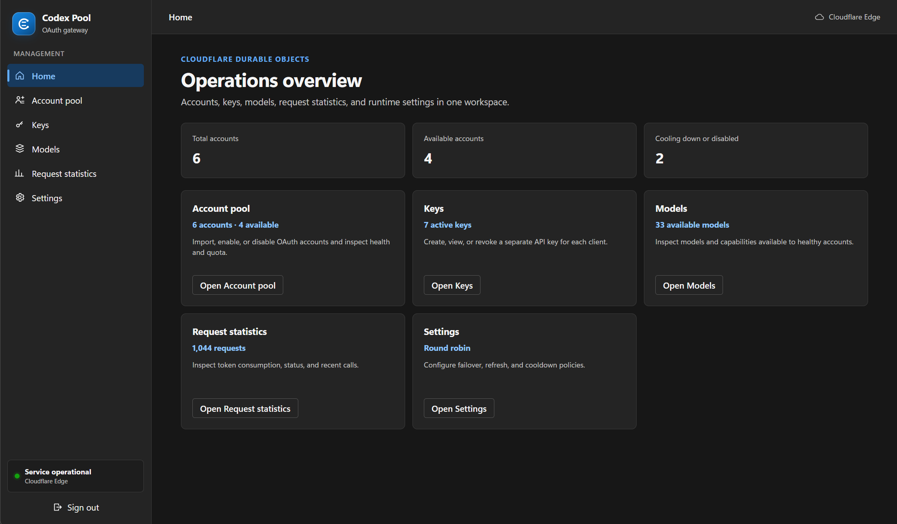

# ChatGPT OAuth API Proxy

English | [简体中文](README.zh-CN.md)

[](https://deploy.workers.cloudflare.com/?url=https://github.com/xx025/codex-oauth-proxy)

Click the button above to deploy in your browser. No local download or npm command is required.

Use ChatGPT OAuth accounts through an OpenAI-compatible API. This project runs entirely on Cloudflare Workers and Durable Objects, with a built-in administration UI for adding accounts, creating client API keys, and viewing request statistics.

It is useful when you want API clients to call `/v1/models`, `/v1/chat/completions`, `/v1/responses`, or `/mcp` while the upstream credentials are managed as ChatGPT OAuth accounts.

> The upstream interface is not a documented public API and may change. Use only accounts you control and follow the applicable terms.

## Screenshot



## Features

- OpenAI-compatible Models, Chat Completions, and Responses APIs
- ChatGPT OAuth account import, device login, and browser PKCE login
- Multi-account rotation, cooldown, token refresh, and failover
- Streaming SSE forwarding and non-streaming buffered responses
- Client API keys separate from administrator access
- Built-in administration UI and request statistics
- Stateless MCP JSON-RPC endpoint
- Mandatory Cloudflare VPC egress through `NATIVE_EGRESS`

## How It Works

```text
Client / Admin
      |
      v
Cloudflare Worker
      |
      +-- Admin UI and settings --> AccountPool Durable Object
      |
      +-- API requests ----------> ProxyExecutor Durable Objects
                                      |
                                      v
                              NATIVE_EGRESS VPC
                                      |
                                      v
                         chatgpt.com / auth.openai.com
```

State such as OAuth tokens, accounts, client keys, settings, and statistics is stored in Durable Object storage. Prompts and responses are not persisted.

All upstream requests must use the `NATIVE_EGRESS` VPC binding. The Worker fails closed if that binding is missing.

## Deploy

Detailed Chinese deployment steps are in [docs/deployment.zh-CN.md](docs/deployment.zh-CN.md).

Recommended: click the Deploy to Cloudflare button above and finish setup in the browser. Users do not need to clone the repository, install Node.js, or run npm locally.

In the Cloudflare setup page, fill two required values:

- `CLOUDFLARE_TUNNEL_ID`: build variable, your Cloudflare Tunnel/VPC egress ID
- `KEY_ENCRYPTION_SECRET`: Worker secret, a random value such as `openssl rand -hex 32`

If the admin domain is not protected by Cloudflare Access, also set `ADMIN_API_KEY` as a Worker secret.

Command-line deployment is also available. You do not need to edit `wrangler.jsonc`; the deploy script creates a temporary Wrangler config from `CLOUDFLARE_TUNNEL_ID`:

```bash
npm ci
npx wrangler login
npx wrangler secret put KEY_ENCRYPTION_SECRET
CLOUDFLARE_TUNNEL_ID=YOUR_TUNNEL_ID npm run deploy
```

If you do not protect the admin domain with Cloudflare Access, also set:

```bash
npx wrangler secret put ADMIN_API_KEY
```

Check the deployment:

```bash
curl https://YOUR_WORKER_DOMAIN/health
```

Open the Worker URL, add a ChatGPT OAuth account, and create a client API key. API clients can use either header:

```text
Authorization: Bearer YOUR_CLIENT_KEY
X-API-Key: YOUR_CLIENT_KEY
```

## API Example

```bash
curl https://YOUR_WORKER_DOMAIN/v1/chat/completions \
  -H "Authorization: Bearer YOUR_CLIENT_KEY" \
  -H "Content-Type: application/json" \
  -d '{"model":"gpt-5.6-sol","messages":[{"role":"user","content":"Hello"}],"stream":true}'
```

## Development

```bash
npm run typecheck
npm test
npm run build
```

Useful files:

- `src/index.ts`: Worker routes and Durable Objects
- `src/api.ts`: OpenAI-compatible request and response handling
- `src/pool.ts`: account pool, client keys, settings, and statistics
- `src/oauth.ts`: OAuth login and token refresh
- `src/egress.ts`: mandatory VPC egress and upstream host allowlist
- `src/mcp.ts`: MCP adapter
- `src/ui.ts`: embedded administration UI
- `wrangler.jsonc`: Cloudflare Worker configuration

## License

[MIT](LICENSE)
